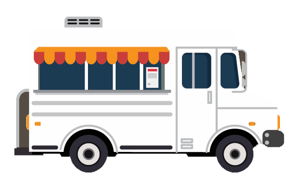

#Food Truck Finder:

###1. User clicks on cuisine he/she wants.
###2. User enters location, how far he/she wants to travel, and clicks search.
###3. User clicks directions for a food truck on the list and Google maps driving directions for them.
###4. User has the option of clicking restaurant name and website redirects them to the restaurant's website:
